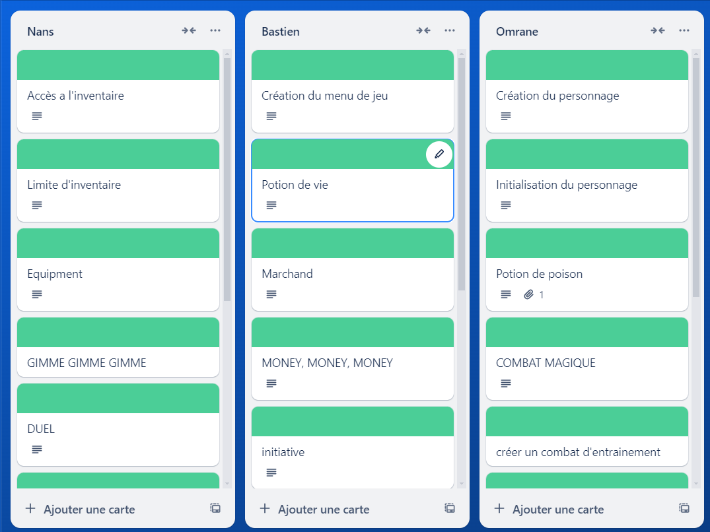

# Projet-RED
Projet red de premiere année B1 info/cyber a ynov nous
donnant comme objectif de créer un jeu avec 
le language de programmation Golang 

## Prérequis 
#### installation de Golang via le site web
https://go.dev/doc/install

verification de la verison :
``` bash
 go version 
```
Personellement pour mon projet j'ai utiliser la --color go1.23.0 windows/amd64
## Breve  Présentation du jeu

Valorant TBT est un jeu tour par tour sur le thème de Valorant 
avec un systeme d'attaque, d'achat, d'amélioration et de Combat en 
utilisant les agents phare de Valorant tels que Brimstone, Sage, Phoenix et sky !

## Organisation

nous avons créer un dossier projet RED puis par la suite créer plusieurs fichier dont un fichier doc 
avec le nom du projet et du groupe et plusieurs dossier avec les fichiers suivant main.go, Menus.go, ChoixAgent.go, clear.go
si vous voulez voir notre Trello et miro pour voir toute notre Organisation !

[Miro](https://miro.com/welcomeonboard/bFhtU1ZUVHVhZjhXTkpBNHBoNHI3Z1laWXM5djdHVlk4QnRhMjFtYnZ6NEt6YzNmaEZvWWk0UGZBTTM1TzQ2eXwzNDU4NzY0NTk5NjM5NTE1NjU0fDI=?share_link_id=47032294332)

trello : 
 


# Auteur 
- [Omrane RIAHI](https://github.com/Omrane02/Omrane02)
- [Nans MOLL](https://github.com/nans-moll)
-  [Bastien JOUFFRE](https://github.com/jfrbast)


